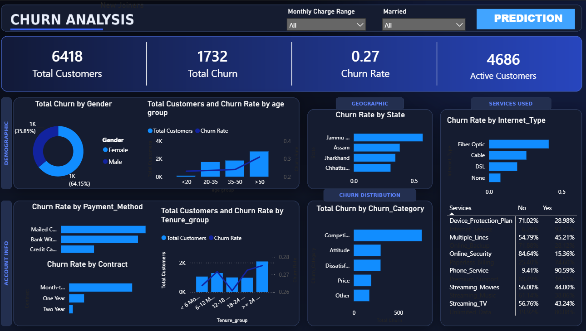
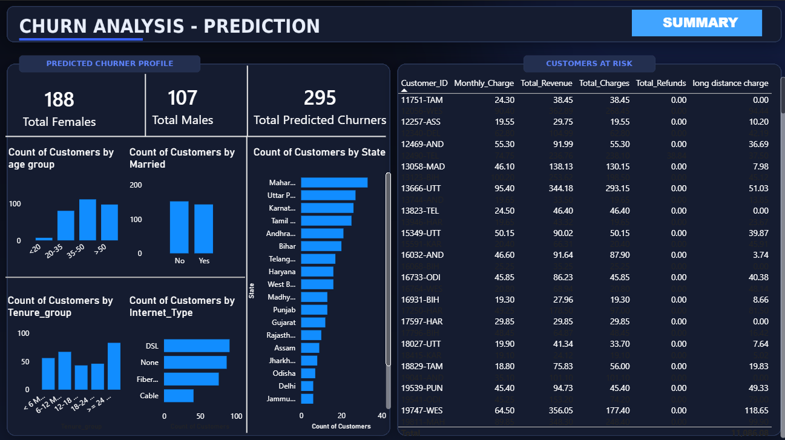

# 📡 Telecom Customer Churn Prediction & Retention Analytics

> End-to-end data science project covering SQL-based data cleaning, exploratory analysis, machine learning model development, and a Power BI retention dashboard — built to turn raw telecom data into an actionable customer retention strategy.

---

## 📋 Table of Contents

- [Project Overview](#-project-overview)
- [Dataset](#-dataset)
- [Data Cleaning & Preprocessing](#-data-cleaning--preprocessing)
- [Key Business Insights (EDA)](#-key-business-insights-eda)
- [Feature Selection & Leakage Prevention](#-feature-selection--leakage-prevention)
- [Model Development](#-model-development)
- [Model Performance](#-model-performance)
- [Retention Strategy](#-recommended-retention-strategy)
- [Power BI Dashboard](#-power-bi-dashboard)
- [Business Impact](#-business-impact)
- [Tech Stack](#-tech-stack)
- [Author](#-author)

---

## 🎯 Project Overview

Customer churn is one of the most expensive problems a telecom company faces — acquiring a new customer typically costs far more than retaining an existing one. This project builds a **full-lifecycle churn prediction pipeline**: cleaning raw customer data with SQL, uncovering the business drivers of churn through EDA, building and tuning a classification model, and translating the output into a Power BI dashboard that business teams can act on directly.

The guiding principle throughout: **optimize for business impact, not just accuracy.** A missed churner (false negative) costs the business far more than a retention offer given to a loyal customer (false positive) — so every decision, from feature selection to the precision-recall trade-off, was made with that asymmetry in mind.

---

## 🗂 Dataset

| Attribute | Detail |
|---|---|
| Records | 6,400+ customers |
| Columns | 32 features |
| Domain | Telecom subscriber data |
| Granularity | One row per customer |

---

## 🧹 Data Cleaning & Preprocessing

Raw data was cleaned and standardized using **SQL** to produce an analysis-ready production dataset:

- Replaced `NULL` values with business-contextual defaults to ensure completeness
- Identified and removed duplicate records to preserve data integrity
- Standardized formats and validated attribute consistency across the dataset
- Delivered a clean, structured dataset ready for EDA and model development

This pipeline ensured every downstream insight and prediction was built on a reliable, consistent foundation.

---

## 📊 Key Business Insights (EDA)

Exploratory analysis surfaced the strongest, most actionable drivers of churn:

### 1. Contract Type — the strongest predictor of churn ⭐⭐⭐⭐⭐
Month-to-Month customers churn substantially more than One-Year or Two-Year customers. Long-term commitment is the single biggest lever for retention.

### 2. Fiber Optic customers churn the most ⭐⭐⭐⭐⭐
Despite being the most popular internet service, Fiber Optic has the highest churn rate — pointing to pricing, network quality, or service satisfaction issues within this segment.

### 3. Experience drives churn more than price ⭐⭐⭐⭐⭐
**Competitor-related reasons** are the single biggest churn driver, followed by **attitude/dissatisfaction** — together outweighing price-related churn. Customers are leaving for a better experience, not just a better deal.

### 4. The first few months are the highest-risk period ⭐⭐⭐⭐
Customers with shorter tenure churn more frequently, making early-lifecycle engagement critical to long-term retention.

### 5. Higher monthly charges correlate with higher churn ⭐⭐⭐⭐
Premium-tier customers churn more, suggesting the perceived value doesn't yet match the price for some segments.

### 6. Value-added services reduce churn ⭐⭐⭐⭐
Customers subscribed to **Online Security** retain significantly better than those without it.

| Business Parameter | Influence on Churn |
|---|---|
| Contract Type | ⭐⭐⭐⭐⭐ Very High |
| Internet Type | ⭐⭐⭐⭐⭐ Very High |
| Churn Category | ⭐⭐⭐⭐⭐ Very High |
| Monthly Charges | ⭐⭐⭐⭐ High |
| Tenure | ⭐⭐⭐⭐ High |
| Online Security | ⭐⭐⭐⭐ High |
| Value Deal | ⭐⭐⭐ Moderate |
| Payment Method | ⭐⭐⭐ Moderate |
| State | ⭐⭐⭐ Moderate |
| Total Charges | ⭐⭐⭐ Moderate |
| Gender | ⭐ Low |
| Age | ⭐ Low (alone) |

**Bottom line:** churn is driven primarily by **controllable business factors** — contract structure, service quality, pricing perception, and value-added services — not demographics.

> *Note: the ratings above reflect business/diagnostic importance observed in EDA — including post-churn fields like Churn Category, which explain **why** customers left but can't be used to **predict** who will leave next. The model's actual, technical feature importance (computed after training) is below.*

---

## 🔍 Feature Selection & Leakage Prevention

Before model training, a dedicated feature-importance pass was run to prevent **data leakage** and remove non-predictive noise. The following fields were excluded:

`Customer_ID`, `Churn_Category`, `Churn_Reason`, `Total_Revenue`, `Total_Charges`, `Total_Refunds`, `Total_Extra_Data_Charges`, `Total_Long_Distance_Charges`

These were removed because they either:
- Acted as unique identifiers with no predictive signal, **or**
- Contained information only available *after* the churn outcome, **or**
- Directly revealed the churn label itself, **or**
- Added negligible incremental predictive value

**Why `Total_Charges` and `Total_Revenue` specifically had to go:** both are cumulative fields — they grow with `Tenure_in_Months` (more months as a customer = more billed revenue). That dependency makes them a **structural proxy for tenure and churn timing, not an independent signal**. A customer who churned early will *always* show a low Total_Charges, regardless of how "at risk" they actually were — so the model would end up learning the outcome through the back door instead of learning genuine risk drivers. Keeping them in would have inflated performance metrics on paper while producing a model that quietly leaks the answer, which falls apart the moment it's used on real, currently-active customers.

This ensured the model only ever learns from information realistically available **before** a customer churns — critical for a solution that's actually deployable in production.

### 🌲 Feature Importance — Computed by the Trained Random Forest

Once the model was trained, its native feature importances confirmed (and sharpened) the EDA-driven business intuition:

| Rank | Feature | Relative Importance |
|---|---|---|
| 1 | **Contract** | ~0.38 — by a massive margin, the single dominant driver |
| 2 | Monthly_Charge | ~0.07 |
| 3 | Internet_Type | ~0.07 |
| 4 | Online_Security | ~0.06 |
| 5 | Value_Deal | ~0.06 |
| 6 | Premium_Support | ~0.055 |
| 7 | Age | ~0.045 |
| 8 | Internet_Service | ~0.04 |

**Key takeaway:** `Contract` alone accounts for more predictive weight than the next several features combined — the model independently arrived at the same conclusion the EDA did, which is a strong validation signal. Support-related features (`Online_Security`, `Value_Deal`, `Premium_Support`) also rank well ahead of raw demographics like `Gender` and `Married`, reinforcing that service and plan structure — not who the customer is — drives churn.

---

## 🤖 Model Development

Two models were built and independently hyperparameter-tuned before being compared head-to-head:

| Model | Tuning Method |
|---|---|
| Logistic Regression | `GridSearchCV`, 5-fold cross-validation |
| **Random Forest** | `RandomizedSearchCV` — 100 sampled combinations, 5-fold cross-validation, across tree count, depth, min samples per split/leaf, feature selection strategy, and bootstrap sampling |

Each model's own best configuration was then evaluated on a held-out test set:

| Metric (Churn class) | Logistic Regression | Random Forest |
|---|---|---|
| Precision | 0.53 | **0.57** |
| Recall | 0.80 | 0.80 |
| F1-Score | 0.64 | **0.67** |
| Accuracy | 0.74 | **0.78** |

*(Figures come straight from each model's own tuned classification report. The two test sets have a slightly different churner count — 347 vs. 331 — since each tuning run held out its own split, but both are evaluated on the same total sample size of 1,202.)*

**Why Random Forest was chosen:** both models were tuned to essentially the same recall (~80%) — so they catch churners at the same rate. The real difference is *how many false alarms each one raises to get there*. Logistic Regression flags 242 loyal customers as false positives to hit that recall; Random Forest reaches the same recall with only 198 false positives. That gap carries straight through to precision (0.57 vs. 0.53), F1-score (0.67 vs. 0.64), and overall accuracy (0.78 vs. 0.74) — Random Forest wins on every metric except recall, where the two are tied. In practical terms: for the same number of at-risk customers caught, Random Forest sends far fewer unnecessary retention offers to customers who were never actually at risk — which is exactly what the business cares about.

---

## 📈 Model Performance

| Metric | Score |
|---|---|
| Recall | 0.80 |
| Precision | 0.57 |
| F1-Score | 0.67 |

**Why recall was prioritized:** churn prediction is a cost-sensitive problem — the cost of *missing* a customer who churns (false negative) is far higher than the cost of offering a retention incentive to someone who would have stayed anyway (false positive). Optimizing for 80% recall means the business can proactively intervene with 4 out of 5 at-risk customers before they leave, while the 57% precision keeps retention spend targeted rather than blanket.

---

## 🎯 Recommended Retention Strategy

> **📌 The trade-off behind this strategy — Recall vs. Precision:** the model was deliberately tuned to prioritize **Recall (80%)** over Precision (57%), because in churn, a false negative (missing a customer who leaves) is far costlier than a false positive (offering an incentive to someone who'd have stayed anyway). Practically, this means the strategy below is built to **cast a wide, proactive net** across at-risk segments rather than waiting for near-certain signals — accepting some "wasted" retention spend as the price of catching the majority of actual churners before they leave.

With that trade-off in mind, six segment-level actions deliver the highest return, ranked by the strength of their underlying driver:

**1. Migrate Month-to-Month customers onto longer contracts.**
`Contract` is the single dominant feature in the model (~0.38 importance — more than every other feature combined). Even a modest shift of Month-to-Month customers onto One-Year plans, via targeted discounts, bundled perks, or loyalty pricing, should move the churn needle more than any other lever available.

**2. Fix the Fiber Optic experience, don't just discount it.**
Fiber Optic is the most popular internet type *and* the highest-churning one — meaning price cuts alone won't hold these customers. Investigate network reliability and service quality directly, and route Fiber customers into a dedicated retention and support track.

**3. Treat competitor-driven churn as a service problem, not a pricing problem.**
Competitor-related reasons and general dissatisfaction outrank price as churn causes. This means the fix is competitive benchmarking and faster issue resolution — not blanket discounting, which erodes margin without addressing why customers are actually leaving.

**4. Give extra attention to customers in their first 6 months.**
New customers are the most likely to leave. If we welcome them properly, check in with them early, and help them get comfortable using the service, most of them will stick around. It's always easier and cheaper to keep a new customer happy than to win back one who has already decided to leave.

**5. Bundle Online Security, Value Deal, and Premium Support into core plans.**
All three rank in the model's top six most important features — customers with these attached are structurally stickier. Making them default (or a free-trial upsell) rather than an opt-in add-on should lift retention across the board, not just for one segment.

**6. Re-justify value for high monthly-charge customers before they compare elsewhere.**
Higher bills correlate with higher churn, pointing to a perceived value gap at the premium tier. Rather than discounting, pair these customers with visible added value — priority support, exclusive perks — timed just ahead of their renewal window.

---

## 📊 Power BI Dashboard

The final model output was operationalized into a **two-page Power BI dashboard** — one page for the historical picture, one for forward-looking predictions.

### Page 1 — Churn Analysis (Summary)

  

A full diagnostic view of the existing customer base:

- **Top-line KPIs:** 6,418 total customers, 1,732 total churn, a 0.27 churn rate, and 4,686 active customers
- **Demographics:** churn split by gender, and total customers with churn rate overlaid by age group
- **Account info:** churn rate by payment method, by contract type, and by tenure group (customer count + churn rate trend on the same chart)
- **Geographic:** churn rate by state, surfacing regional hotspots like Jammu & Kashmir
- **Churn distribution:** churn by category (Competitor, Attitude, Dissatisfaction, Price, Other)
- **Services used:** churn rate breakdown across Device Protection, Multiple Lines, Online Security, Phone Service, and Streaming services
- Interactive slicers for **Monthly Charge Range** and **Married** status let stakeholders filter the entire view on the fly

### Page 2 — Churn Analysis (Prediction)

  

This page runs the trained model against a **batch of newly-joined customers** — individuals with no historical churn label yet — to generate forward-looking risk scores instead of just describing the past:

- **Predicted churner profile:** out of **411 newly-joined customers** run through the model, **295 were predicted to churn and 116 were predicted to stay** — the 295 predicted churners break down further into 188 female and 107 male
- Breakdowns of the predicted-churner group by **age group, marital status, tenure group, internet type, and state**, so retention teams can see *which kind* of new customer is most at risk, not just the headline count
- A **"Customers at Risk"** table listing individual flagged customers (Customer ID, Monthly Charge, Total Revenue, Total Charges, Total Refunds, Long Distance Charge) — giving the retention team both *who* to contact and *how much revenue* is riding on each account

**Important distinction:** `Total_Revenue` and `Total_Charges` appear in this table purely as **business context** — to size the revenue at risk per customer — not as inputs the model used to generate the prediction. Feeding them into the model itself would have caused the leakage explained above; surfacing them *after* prediction, for reporting only, is safe and useful.

Together, the two pages let stakeholders move from "what happened and why" to "who's likely to leave next and what's it worth" — without touching the underlying model.

---

## 💼 Business Impact

- **Proactive retention:** identifies 80% of at-risk customers before they churn
- **Cost-efficient targeting:** 57% precision reduces wasted retention spend on low-risk customers
- **Revenue protection:** flags high total-charge (VIP) accounts for early intervention
- **Root-cause clarity:** reframes churn as a *controllable* business problem (contract, service, experience) rather than a demographic one
- **Decision-ready reporting:** Power BI dashboard puts churn risk directly in front of business stakeholders

---

## 🛠 Tech Stack

- **SQL** — data cleaning, preprocessing, aggregation
- **Python** (pandas, scikit-learn) — EDA, feature engineering, model building
- **Random Forest / Logistic Regression** — churn classification
- **RandomizedSearchCV** — hyperparameter tuning
- **Power BI** — dashboarding and business reporting

---

## 👤 Author

**Anuj**
Electronics and Communication Engineering | Data Analytics & Software Development

*Feel free to connect for feedback, collaboration, or questions about the methodology.*

---

<i>⭐ If you found this project useful, consider giving it a star!</i>

